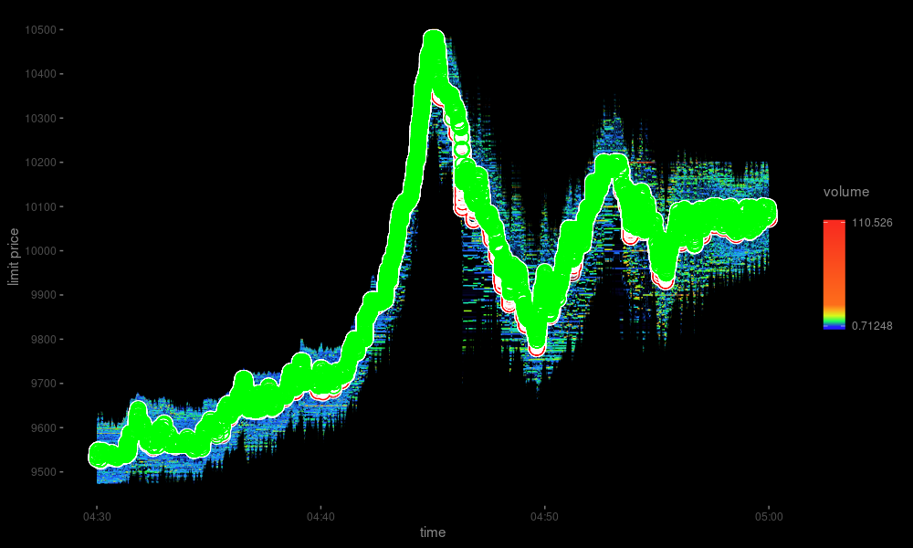
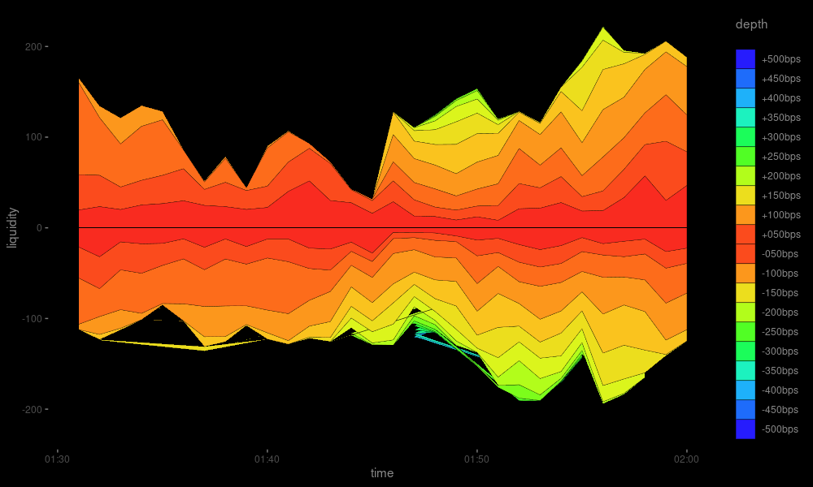
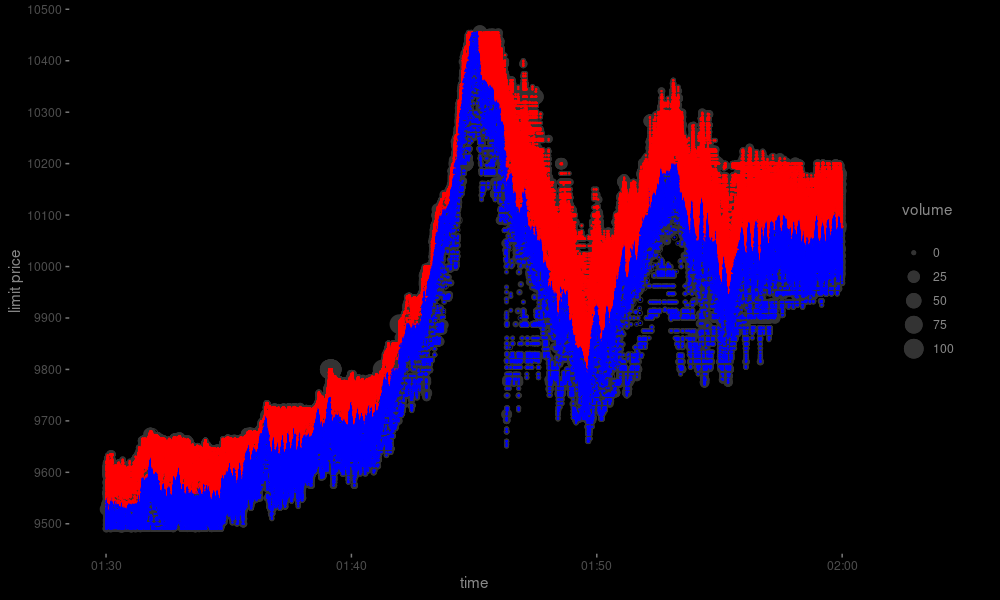
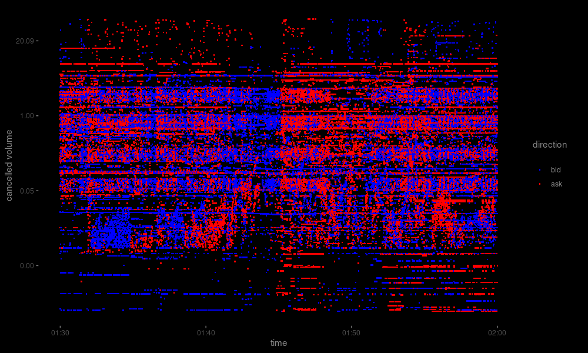
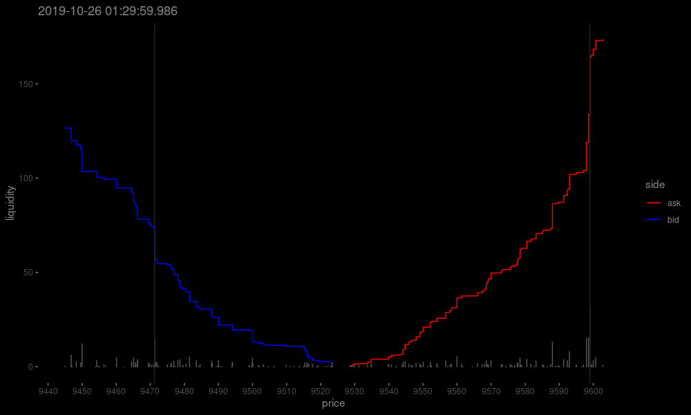

OBADiah
================

OBADiah (**O**rder **B**ook **A**nalytics **D**atabase) is a system
consisting of (i) a Python module for capturing raw high-frequency data
from an exchange, (ii) a PostgreSQL database for processing & storing
the captured data and (iii) the R package for rendering the processed
data in the format suitable for visualization by
[`obAnalytics`](https://github.com/phil8192/ob-analytics) R package.

You can browse the database online using **obadiah-browser** application
available [here.](https://petr-fedorov.shinyapps.io/obadiah-browser/)


To access the database programmatically one needs to get a signed SSL
certificate as described
[here](https://github.com/petr-fedorov/obadiah/wiki/How-to-connect-to-the-database).
Afterwards it is possible to connect:

``` r
config <- config::get()
con <- DBI::dbConnect(RPostgres::Postgres(), user=config$user,dbname=config$dbname, host=config$host,
                      port=config$port, sslmode="require", sslrootcert=config$sslrootcert,
                      sslcert=config$sslcert,sslkey=config$sslkey,bigint="numeric")
```

Having the connection established, one need to choose the exchange, pair
and period.

Currently the database contains data from the following exchanges:

 

``` r
library(lubridate, quietly = T, warn.conflicts=F)

start.time <- with_tz(ymd_hms('2019-10-26 04:30:00+03'), tz='Europe/Moscow')
end.time <- with_tz(ymd_hms('2019-10-26 05:00:00+03'), tz='Europe/Moscow')
exchange <- 'Bitfinex'
pair <- 'BTCUSD'
```

Now the data can be
downloaded

``` r
depth <- obadiah::depth(con,start.time, end.time, exchange, pair, tz='Europe/Moscow')
spread <- obadiah::spread(con,start.time, end.time, exchange, pair, tz='Europe/Moscow')
trades <- obadiah::trades(con,start.time, end.time, exchange, pair, tz='Europe/Moscow')
```

and
visualized

``` r
obAnalytics::plotPriceLevels(depth, spread, trades, start.time = start.time, end.time = end.time )
```

<!-- -->

`obadiah` provides data for all visualisation functions in `obAnalytics`
package.

``` r
depth.summary <- obadiah::depth_summary(con,start.time, end.time, exchange, pair)
```

``` r
obAnalytics::plotVolumePercentiles(depth.summary, start.time = start.time, end.time = end.time )
```

<!-- -->

``` r
events <- obadiah::events(con,start.time, end.time, exchange, pair)
```

``` r
obAnalytics::plotEventMap(events, start.time = start.time, end.time = end.time)
```

<!-- -->

``` r
obAnalytics::plotVolumeMap(events,  start.time = start.time, end.time = end.time, log.scale = T)
```

<!-- -->

``` r
order.book <- obadiah::order_book(con, start.time, exchange, pair)
```

``` r
obAnalytics::plotCurrentDepth(order.book)
```

<!-- -->
